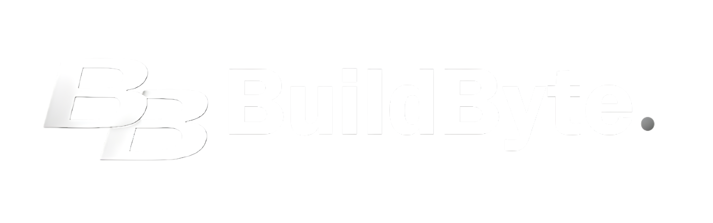
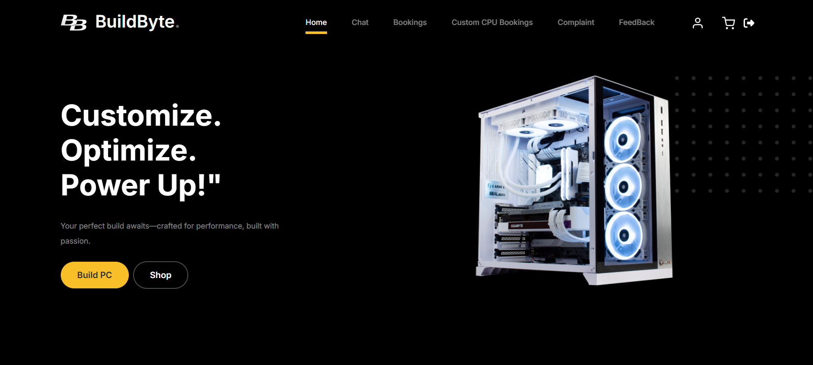
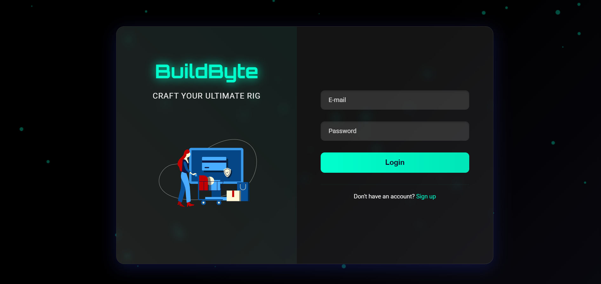
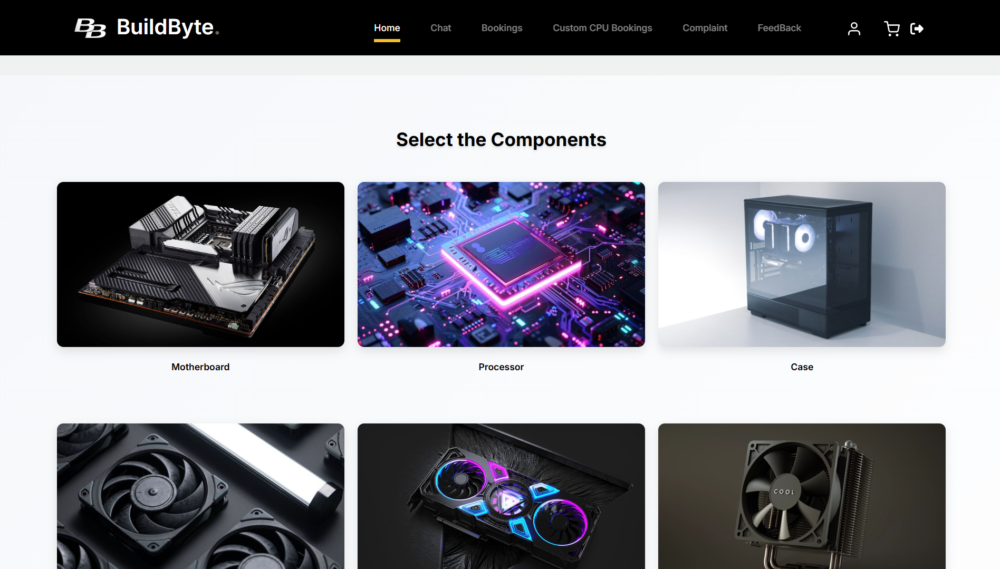
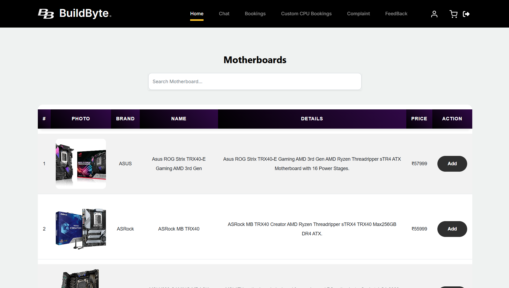

# BuildByte – Custom PC Builder Web App

<p align="left">
  
</p>

BuildByte is a Django-based web application that allows users to customize and configure personal computers by selecting compatible components like CPU, GPU, RAM, Storage, etc. This project was developed as part of my BCA final year.

---

📌 Features

- 🧩 Choose and configure PC components
- 💰 Real-time total cost calculation
- 🛒 Add to cart functionality
- 👨‍💻 Admin panel to manage products and categories
- 🔐 User authentication and login
- 🎨 Clean and responsive UI

---

🛠 Tech Stack

| Layer        | Technology         |
|--------------|--------------------|
| Backend      | Python, Django     |
| Frontend     | HTML, CSS, Bootstrap |
| Database     | SQLite (Development), PostgreSQL (Production) |
| Hosting      | Render (Free)      |
| Version Control | Git + GitHub     |

---

📸 Screenshots

🔹 Homepage
   

🔹Loginpage
   

🔹 PC Component selection
   
   
🔹 Products List
   
   
🚀 Getting Started (Run Locally)

To run this project locally on your system:

1. Clone the Repository
```bash
git clone https://github.com/Abineldho06/BuildByte.git
cd BuildByte
